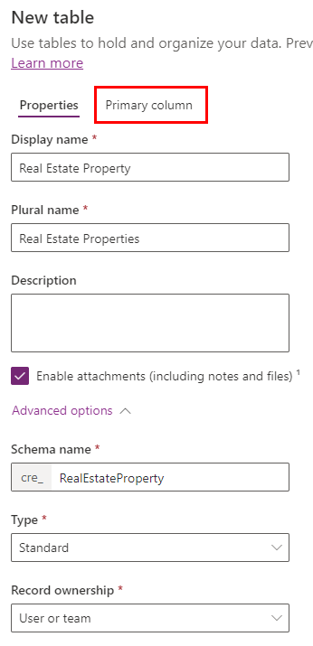

---
lab:
    title: 'Lab 2: Data model'
    module: 'Module 1: Create tables in Dataverse'
---

# Practice Lab 2 - Data model

## Scenario

In this lab, you will create Dataverse tables, columns, and relationships.

Contoso Real Estate wants to track two key elements:

- Real estate property listings
- Who is scheduled for showings of real estate properties

## What you will learn

- How to create tables in Dataverse
- How to add columns to Dataverse tables
- How to create relationships between tables

## High-level lab steps

- Create tables
- Create columns
- Create relationships
  
## Prerequisites

- Must have completed **Lab 1: Publisher and solution**

## Detailed steps

## Exercise 1 - Create tables

In this exercise, you will create and add tables to the solution.

### Task 1.1 – Create Real Estate Property table

1. Navigate to the Power Apps Maker portal <https://make.powerapps.com>.

1. Make sure you are in the **Dev One** environment.

1. Select **Solutions**.

1. Open the **Property listings** solution.

1. Select **+ New** and then select **Table** and select **Table** again.

    

1. Enter `Real Estate Property` for **Display Name**. The plural name will be automatically populated.

1. Check **Enable attachments**.

1. Expand **Advanced options**.

    

1. Select the **Primary column** tab.

1. Enter `Property Name` for **Display Name**.

1. Expand **Advanced options**.

    

1. Select the **Properties** tab.

1. Expand **Advanced options**.

1. Check **Creating a new activity**.

1. Check **Appear in search results**.

    

1. Select **Save**.

    

1. Select **Properties**.

1. If *Enable attachments* is not checked for the Real Estate Property table, then check **Enable attachments** again and select **Save**.

### Task 1.2 – Create Showing table

1. In the **Objects** pane, select **All**.

1. Select **+ New** and then select **Table** and select **Table** again.

1. Enter `Showing` for **Display Name**. The plural name will be automatically populated.

1. Expand **Advanced options**.

1. Check **Appear in search results**.

1. Select **Save**.

### Task 1.3 – Create Open House table

1. In the **Objects** pane, select **All**.

1. Select **+ New** and then select **Table** and select **Table** again.

1. Enter `Open House` for **Display Name**. The plural name will be automatically populated.

1. Expand **Advanced options**.

1. Select **Organization** for **Record ownership**.

1. Select **Save**.

### Task 1.4 – Add contact table

1. In the **Objects** pane, select **All**.

1. Select **Add existing** and choose **Table**.

1. Select the **Contact** table.

1. Select **Next**.

1. Select **Add**.

## Exercise 2 - Create columns

In this exercise, you will create columns to the tables to the solution.

### Task 2.1 – Create Real Estate Property columns

1. Navigate to the Power Apps Maker portal <https://make.powerapps.com>.

1. Make sure you are in the **Dev One** environment.

1. Select **Solutions**.

1. Open the **Property listings** solution.

1. Select the **Real Estate Property** table.

1. Under **Schema**, select **Columns**.

1. Select **+ New column**.

    

1. Enter `Asking Price` for **Display name**.

1. Select **Currency** in the **Data type** drop-down.

1. In the **Required** drop-down, select **Business required**.

1. Select **Save**.

1. Select **+ New column**.

1. Enter `Street` for **Display name**.

1. Select **Single line of text** in the **Data type** drop-down.

1. In the **Required** drop-down, select **Business required**.

1. Select **Save**.

1. Select **+ New column**.

1. Enter `City` for **Display name**.

1. Select **Single line of text** in the **Data type** drop-down.

1. In the **Required** drop-down, select **Business required**.

1. Select **Save**.

1. Select **+ New column**.

1. Enter `Bedrooms` for **Display name**.

1. Select **Choice** in the **Data type** drop-down and select **Choice** again.

    

1. Select **Yes** for **Sync with global choice**.

1. Select **+ New choice**.

    

1. Enter `Number of Rooms` for **Display name**.

1. Enter `1` for **Label** and `1` for **Value**.

1. Select **+ New choice** and Enter `2` for **Label** and `2` for **Value**.

1. Select **+ New choice** and Enter `3` for **Label** and `3` for **Value**.

1. Select **+ New choice** and Enter `4` for **Label** and `4` for **Value**.

1. Select **+ New choice** and Enter `5` for **Label** and `5` for **Value**.

    

1. Select **Save**.

1. In **Sync this choice with** select **Number of Rooms**.

1. Select **Save**.

1. Select **+ New column**.

1. Enter `Bathrooms` for **Display name**.

1. Select **Choice** in the **Data type** drop-down and select **Choice** again.

1. In **Sync this choice with** select **Number of Rooms**.

1. Select **Save**.

### Task 2.2 – Create Showing columns

1. In the **Objects** pane, select **All**.

1. Select the **Showing** table.

1. Under **Schema**, select **Columns**.

1. Select **+ New column**.

1. Enter `Showing Date` for **Display name**.

1. Select **Date and time** in the **Data type** drop-down.

1. Select **Date only** in the **Format** drop-down.

1. In the **Required** drop-down, select **Business required**.

1. Select **Save**.

1. Select **+ New column**.

1. Enter `Comments` for **Display name**.

1. Select **Text** in the **Data type** drop-down and then select **Multiple lines of text**.

1. Select **Save**.

1. Enter `Level of Interest` for **Display name**.

1. Select **Choice** in the **Data type** drop-down and select **Choice** again.

1. Select **No** for **Sync with global choice**.

1. Enter `Very High` for **Label**.

1. Select **+ New choice** and Enter `High` for **Label**.

1. Select **+ New choice** and Enter `Medium` for **Label**.

1. Select **+ New choice** and Enter `Low` for **Label**.

1. Select **+ New choice** and Enter `No interest` for **Label**.

1. Select **Save**.

1. Select **+ New column**.

1. Enter `Shown by` for **Display name**.

1. Select **Lookup** in the **Data type** drop-down and select **Lookup** again.

1. In the **Related table** drop-down, select **User**.

1. Select **Save**.

### Task 2.3 – Create Open House columns

1. In the **Objects** pane, select **All**.

1. Select the **Open House** table.

1. Under **Schema**, select **Columns**.

1. Select **+ New column**.

1. Enter `Open House Date` for **Display name**.

1. Select **Date and time** in the **Data type** drop-down.

1. Select **Date only** in the **Format** drop-down.

1. In the **Required** drop-down, select **Business required**.

1. Select **Save**

## Exercise 3 - Create relationships

In this exercise, you will create relationships between the tables to the solution.

### Task 3.1 – Real Estate Property to Contact relationship

1. Navigate to the Power Apps Maker portal <https://make.powerapps.com>.

1. Make sure you are in the **Dev One** environment.

1. Select **Solutions**.

1. Open the **Property listings** solution.

1. Select the **Real Estate Property** table.

1. Under **Schema**, select **Relationships**.

1. Select **+ New relationship** and then select **Many-to-one**.

1. In the **Related (One) Table** drop-down select **Contact**

1. Enter `Client` for **Lookup column display name**.

1. In the **Lookup column requirement** drop-down, select **Business Required**.

1. Select **Done**.

### Task 3.2 – Real Estate Property to Showing relationship

1. Select **+ New relationship** and then select **One-to-many**.

1. In the **Related (Many) Table** drop-down select **Showing**

1. In the **Lookup column requirement** drop-down, select **Business Required**.

1. Select **Done**.

### Task 3.3 – Real Estate Property to Open House relationship

1. Select **+ New relationship** and then select **One-to-many**.

1. In the **Related (Many) Table** drop-down select **Open House**.

1. In the **Lookup column requirement** drop-down, select **Business Required**.

1. Expand **General**.

1. Enter `realestateproperty_openhouse` for **Relationship Name**.

1. Select **Done**.

### Task 3.4 – Showing to Contact relationship

1. In the **Objects** pane, select **All**.

1. Select the **Showing** table.

1. Under **Schema**, select **Relationships**.

1. Select **+ New relationship** and then select **Many-to-one**.

1. In the **Related (One) Table** drop-down select **Contact**

1. Enter `Shown to` for **Lookup column display name**.

1. Select **Done**.
