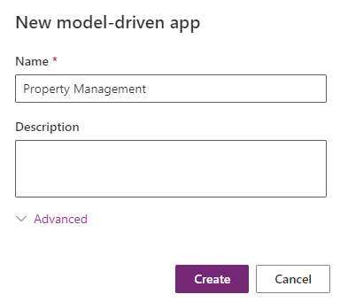
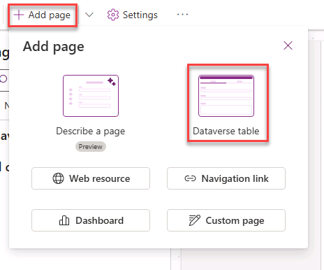

---
lab:
    title: 'Lab 3: Create a model-driven app'
    module: 'Module 2: Get started with model-driven apps in Power Apps'
---

# Practice Lab 3 - Create a model-driven app

## Scenario

In this lab, you will create model-driven app and add tables to the app.

Contoso Real Estate wants to track two key elements:

- Real estate property listings
- Who is scheduled for showings of real estate properties

## What you will learn

- How to create a model-driven app
- How to add tables to the app

## High-level lab steps

- Create a model-driven app
- Add tables to the app
  
## Prerequisites

- Must have completed **Lab 2: Data model**

## Detailed steps

## Exercise 1 - Build model-driven app

In this exercise, you will create a model-driven app.

### Task 1.1 – Create Property Management app

1. Navigate to the Power Apps Maker portal `https://make.powerapps.com`

1. Make sure you are in the **Dev One** environment.

1. Select **Solutions**.

1. Open the **Property listings** solution.

1. Select **+ New** and then select **App** and select **Model-driven app**.

    

1. Enter `Property Management` for **Name**.

1. Select **Create**.

    

### Task 1.2 – Add tables

1. Select **+ Add page**.

    

1. Select **Dataverse table**.

1. Enter `cre` in **Search**.

    

1. Select **Open House**, **Real Estate Property**, and **Showing**.

1. Enter `account` in **Search** and select **Account**.

1. Enter `contact` in **Search** and select **Contact**.

1. Select **Add**.

    

1. Select **Save**.

1. Select **Publish**.

    

### Task 1.3 – Test

1. With the **Property Management** app designer open, select the **Play** button.

1. Navigate to **Contacts**.

1. Select **+ New**.

1. Enter `Jon` for **First Name**.

1. Enter `Doe` for **Last Name**

1. Select **Save & Close**.

1. Navigate to **Real Estate Properties**

1. Select **+ New**.

1. Enter `Test Property` for **Property Name**.

1. Select **Save**.

1. Select **Related** and **Showings**.

    

1. Select **+ New Showing**.

1. Enter `First Showing` for **Name**.

1. Select **Save & Close**.

1. Select **Save & Close**.

