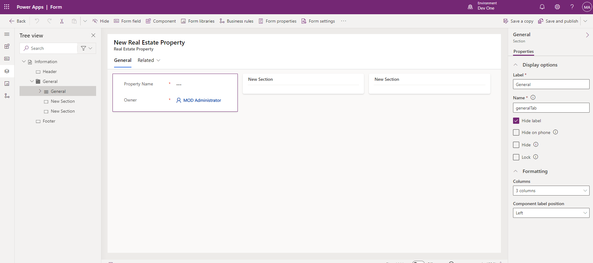
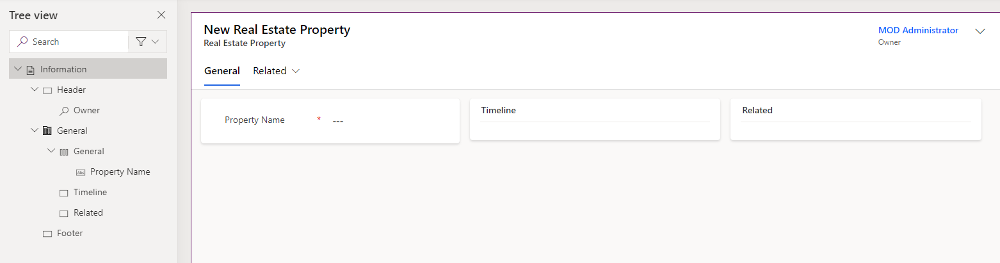
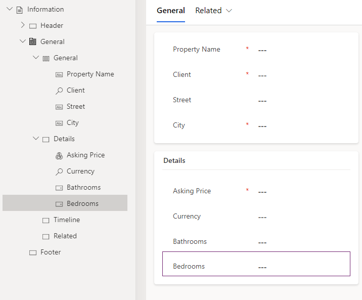
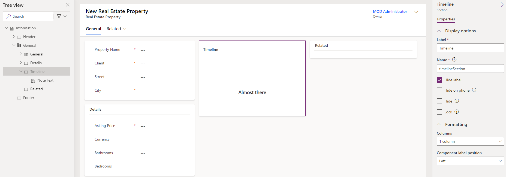
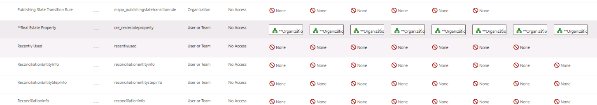
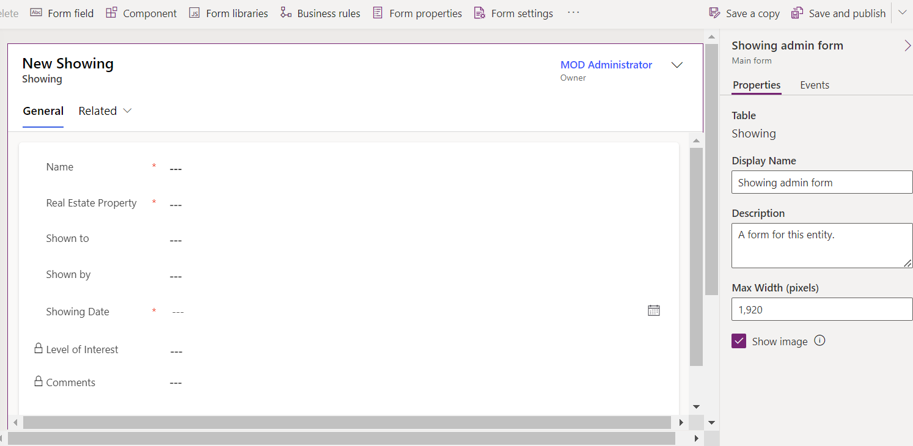
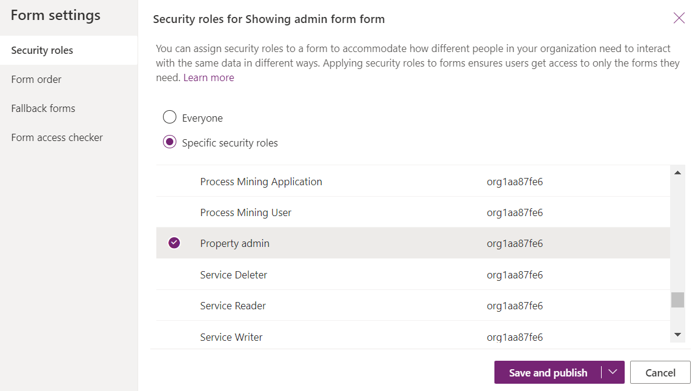
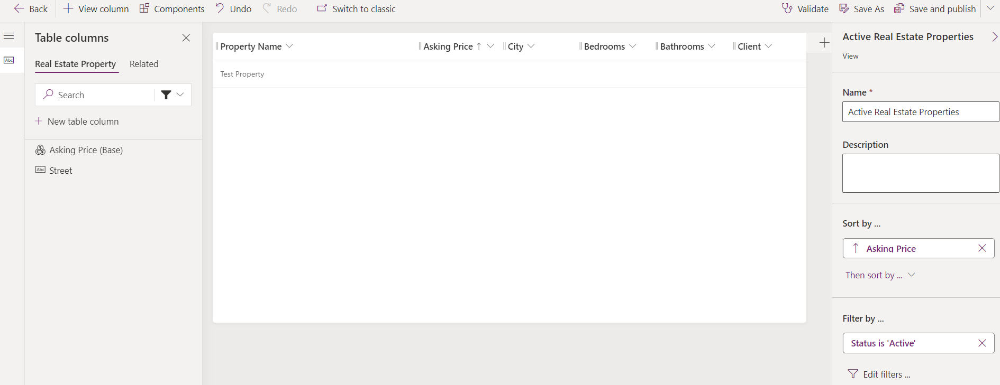

---
lab:
    title: 'Lab 4: Configure forms and views'
    module: 'Module 3: Configure forms, charts, and dashboards in model-driven apps'
---

# Practice Lab 4 - Configure forms and views

## Scenario

In this lab, you will configure forms and views for a model-driven app.

Contoso Real Estate wants to track two key elements:

- Real estate property listings
- Who is scheduled for showings of real estate properties

## What you will learn

- How to configure table forms
- How to configure table views

## High-level lab steps

- Configure the Real Estate Property and Showing main form
- Configure tabs and sections
- Add columns to forms
- Add a subgrid
- Create a new forms
- Associate security roles with forms
- Configure Real Estate Property and Showing views
- Filter views
- Configure Quick Find view
  
## Prerequisites

- Must have completed **Lab 2: Data model**

## Detailed steps

## Exercise 1 - Real Estate Property main form

In this exercise, you will modify the main form for the Real Estate Property table.

### Task 1.1 – Main form layout and columns

1. Navigate to the Power Apps Maker portal `https://make.powerapps.com`

1. Make sure you are in the **Dev One** environment.

1. Select **Solutions**.

1. Open the **Property listings** solution.

1. Select the **Real Estate Property** table.

1. Under **Data experiences**, select **Forms**.

1. Select the **Information** form where the **Form type** is **Main**, select the **Commands** menu (...), and select **Edit** > **Edit in new tab**.

1. Select **Tree view** on the left-hand side of the form designer.

1. Select the **General** tab.

1. Enter `generalTab` for **Name**.

1. In the **Properties** pane on the right-hand side, select **3 columns** in the **Layout** drop-down.

    

1. In the **Tree view**, expand the **General** tab. Select the first section and enter `generalSection` for **Name**.

1. Select the second section and enter `Timeline` for **Label** and `timelineSection` for **Name**.

1. Select the third section and enter `Related` for **Label** and `relatedSection` for **Name**.

1. Drag the **Owner** field into the **Header** area.

    

1. Select the first section.

1. Select **Table columns** from the left navigation in the form designer.

1. Drag the **Client** column below the **Property Name** field.

1. Select the **Street** column to add to the form below **Client**.

1. Select the **City** column to add to the form below **Street**.

1. Select **Components** from the left navigation in the form designer.

1. Select the **1-column section** control to add it to the form.

1. Enter `Details` for **Label** and `detailsSection` for **Name**.

1. Select **Table columns** from the left navigation in the form designer.

1. Select the **Asking Price** column to add to the Details section.

1. Select the **Currency** column to add to the form below **Asking Price**.

1. Select the **Bedrooms** column to add to the form below **Currency**.

1. Select the **Bathrooms** column to add to the form below **Bedrooms**.

    

### Task 1.2 – Add Timeline control

1. Select **Tree view** from the left navigation in the form designer.

1. Select the **Timeline** section.

1. Select **Components** from the left navigation in the form designer.

1. Expand **Display**.

1. Select the **Timeline** control to add it to the **Timeline** section.

1. Select **Tree view** from the left navigation in the form designer, expand **General** tab, and select the **Timeline** section.

1. In the **Properties** pane on the right side, check the **Hide label** box.

    

1. In the **Tree view**, select the **Note Text** control for the Timeline.

1. In the **Properties** pane on the right side, select **Social Activity**, uncheck the **Enable** box, and select **Done**.

1. In the **Properties** pane on the right side, select **Date Created** in the **Sort activities by** drop-down.

1. Select **Table columns** from the left navigation in the form designer.

1. Drag the **Status Reason** column into the **Header** area.

### Task 1.3 – Add Quick View control

1. Select **Tree view** on the left-hand side of the form designer.

1. Select the **Related** section.

1. Select **Components** on the left navigation of the form designer.

1. Expand **Display**.

1. Select the **Quick View** control to add it to the **Related** section.

1. Select **Client** for **Lookup** and **account contact card** for **Contact** and select **Done**.

### Task 1.4 – Add Tab

1. Select **Components** on the left navigation of the form designer.

1. Select the **1-column tab** control to add it to the form.

1. Enter `Showings` for **Label** and `showingTab` for **Label**.

1. Select **Tree view** on the left side of the form designer, expand **Showings** tab, and select the **New Section** section.

1. Enter `Showings` for **Label** and `showingSection` for **Name**.

1. Select **Components** on the left navigation of the form designer.

1. Expand **Grid**.

1. Select the **Subgrid** control to add it to the **Showings** section.

1. Select **Show related records**.

1. Select **Showings** for **Table** and **Active Showings** for **Default view** and select **Done**.

1. Enter `Showings` for **Label** and `showingsSG` for **Name**.

1. Select **Hide label**.

1. Select **Save and publish**.

1. **Close** the form designer.

1. Select **Done**.

## Exercise 2 - Showing main form

In this exercise, you will modify the main form for the Showing table.

### Task 2.1 – Main form layout and columns

1. Navigate to the Power Apps Maker portal `https://make.powerapps.com`

1. Make sure you are in the **Dev One** environment.

1. Select **Solutions**.

1. Open the **Property listings** solution.

1. Select the **Showing** table.

1. Under **Data experiences**, select **Forms**.

1. Select the **Information** form where the **Form type** is **Main**, select the **Commands** menu (...), and select **Edit** > **Edit in new tab**.

1. Drag the **Owner** field into the **Header** area.

1. Select **Table columns** from the left navigation in the form designer.

1. Drag the **Real Estate Property** column below the **Name** field.

1. Select the **Shown to** column to add to the form below **Real Estate Property**.

1. Select the **Shown by** column to add to the form below **Shown to**.

1. Select the **Showing Date** column to add to the form below **Shown by**.

1. Select the **Level of Interest** column to add to the form below **Showning Date**.

1. Select the **Comments** column to add to the form below **Level of Interest**.

1. In the **Properties** pane on the right-hand side, increase **Form field height** to **3 rows**.

1. Select **Save and publish**.

1. **Close** the form designer.

1. Select **Done**.

## Exercise 3 - Multiple forms

In this exercise, you will create a new form and restrict access with a security role.

### Task 3.1 – Security role

1. Navigate to the Power Apps Maker portal `https://make.powerapps.com`

1. Make sure you are in the **Dev One** environment.

1. Select **Solutions**.

1. Open the **Property listings** solution.

1. Select **+ New**, select **Security**, and select **Security role**.

1. Enter `Property admin` for **Role Name**.

1. Select the **Custom Entities** tab.

1. Select **Real Estate Property** table 4 times to change the access level on all privileges to **Organization**.

    

1. Select **Showing** table 4 times to change the access level on all privileges to **Organization**.

1. Select **Save and Close**.

1. Select **Done**.

### Task 3.2 – Copy form

1. Select the **Showing** table.

1. Under **Data experiences**, select **Forms**.

1. Select the **Information** form where the **Form type** is **Main**, select the **Commands** menu (...), and select **Edit** > **Edit in new tab**.

1. Select **Level of Interest** and in the Proprties pane, select **Read-only**.

1. Select **Comments** and in the Proprties pane, select **Read-only**.

1. Select **Save a copy**.

1. Enter `Showing admin form` for **Display Name** and select **Save**.

    

1. Select **Form Settings**.

1. Select the **Property admin** security role.

    

1. Select **Save and publish**.

1. **Close** the form designer.

1. Select **Done**.

## Exercise 4 - Real Estate Property views

In this exercise, you will modify the views for the Real Estate Property table.

### Task 4.1 – Real Estate Property Public view

1. Navigate to the Power Apps Maker portal `https://make.powerapps.com`

1. Make sure you are in the **Dev One** environment.

1. Select **Solutions**.

1. Open the **Property listings** solution.

1. Select the **Real Estate Property** table.

1. Under **Data experiences**, select **Views**.

1. Select the **Active Real Estate Properties** view, select the **Commands** menu (...), and select **Edit** > **Edit in new tab**.

1. Select the caret next to the **Created On** column and select **Remove**.

1. Select the **Asking Price** column to add to the view.

1. Select the **City** column to add to the view.

1. Select the **Bedrooms** column to add to the view.

1. Select the **Bathrooms** column to add to the view.

1. Select the **Client** column to add to the view.

1. In the Properties pane, remove **Property Name** under **Sort by**.

1. In the Properties pane, select **Sort by** and select **Asking Price**.

    

1. Select **Save and publish**.

1. **Close** the view designer.

1. Select **Done**.

### Task 4.2 – Real Estate Property Quick Find view

1. Select the **Quick Find Active Real Estate Properties** view, select the **Commands** menu (...), and select **Edit** > **Edit in new tab**.

1. Select the caret next to the **Created On** column and select **Remove**.

1. In the **Quick Find Active Real Estate Properties** pane on the right, select **Edit find table columns** under **Find by**.

1. Choose the following columns and select **Apply**.

    - City
    - Client
    - Property Name

1. Select **Save and publish**.

1. **Close** the view designer.

1. Select **Done**.

## Exercise 5 - Showing views

In this exercise, you will modify the views for the Showing table.

### Task 5.1 – Showing Public view

1. Navigate to the Power Apps Maker portal `https://make.powerapps.com`

1. Make sure you are in the **Dev One** environment.

1. Select **Solutions**.

1. Open the **Property listings** solution.

1. Select the **Showing** table.

1. Under **Data experiences**, select **Views**.

1. Select the **Active Showings** view, select the **Commands** menu (...), and select **Edit** > **Edit in new tab**.

1. Select the caret next to the **Created On** column and select **Remove**.

1. Select the **Real Estate Property** column to add to the view.

1. Select the **Showing Date** column to add to the view.

1. Select the **Shown to** column to add to the view.

1. Select the **Level of Interest** column to add to the view.

1. Select the **Related** tab.

1. Expand **Real Estate Property**.

1. Select the **Asking Price** column to add to the view.

1. In the Properties pane, remove **Name** under **Sort by**.

1. In the Properties pane, select **Sort by** and select **Showing Date**.

1. On the **Save and publish** drop-down menu, select **Save only**.

### Task 5.2 – New Showing view

1. Select **Save As**.

1. Enter `High Interest showings` for **Name**.

1. Select **Save**.

1. Select the caret next to the **Level of Interest** column and select **Filter by**.

1. Select **Equals** and choose **Very High** and **High**.

1. Select **Apply**.

1. Select **Save and publish**.

1. **Close** the view designer.

1. Select **Done**.
