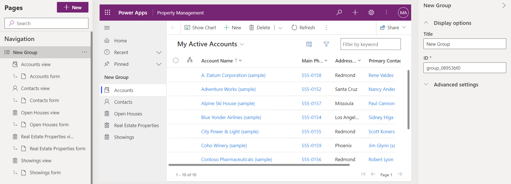
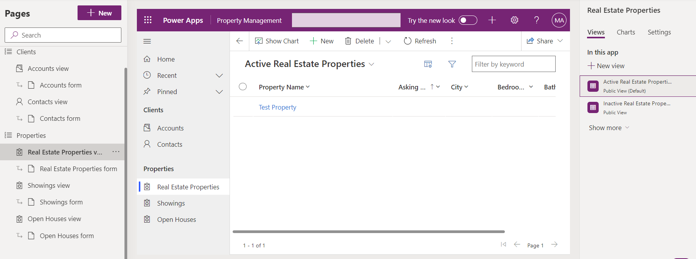
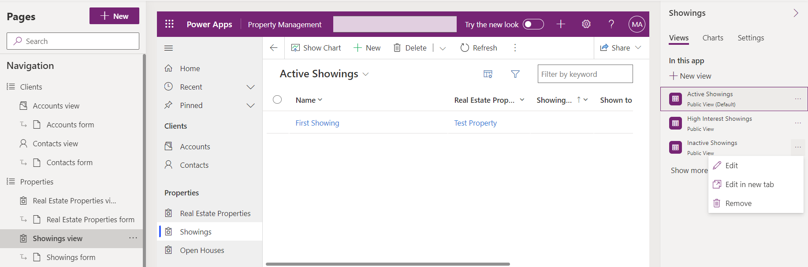

---
lab:
    title: 'Lab 5: Configure a model-driven app'
    module: 'Module 3: Configure forms, charts, and dashboards in model-driven apps'
---

# Practice Lab 5 - Configure a model-driven app

## Scenario

In this lab, you will configure a model-driven app.

## What you will learn

- How to configure navigation for a model-driven app
- How to restrict views in a model-driven app

## High-level lab steps

- Add groups to navigation
- Move tables in navigation
- Restrict views in the app
  
## Prerequisites

- Must have completed **Lab 2: Data model**, **Lab 3: Create model-driven app**, and **Lab 4: Configure forms and views**

## Detailed steps

## Exercise 1 - Configure model-driven app

In this exercise, you will configure navigation and tables a model-driven app.

### Task 1.1 – Configure groups

1. Navigate to the Power Apps Maker portal <https://make.powerapps.com>.

1. Make sure you are in the **Dev One** environment.

1. Select **Solutions**.

1. Open the **Property listings** solution.

1. In the **Objects** pane on the left, select **Apps**.

1. Select the **Property Management** app, select the **Commands** menu (...), and select **Edit** > **Edit in new tab**.

1. Select **New Group** in the **Navigation** pane.

    

1. In the properties pane, enter `Clients` for **Title**.

1. Select **Navigation**, select the **Commands** menu (...) **...** and select **New group**.

1. In the properties pane, enter `Properties` for **Title**.

1. In the **Navigation pane**, select **Showings view** , select the **Commands** menu (...) and select **Move down**.

1. In the **Navigation pane**, select **Real Estate Properties view** , selectthe **Commands** menu (...) and select **Move down**.

1. In the **Navigation pane**, select **Open Houses view** , select the **Commands** menu (...) and select **Move down** three times

    

### Task 1.2 – Restrict views

1. In the **Navigation** pane, select **Showings view**.

1. In the **Showings** pane, select the **Views** tab.

1. Select the **Inactive Showings view**, in the right-hand pane, and select the **Commands** menu (...) and select **Remove**.

    

1. Select **Save**.

1. Select **Publish**.

1. **Close** the app designer.
