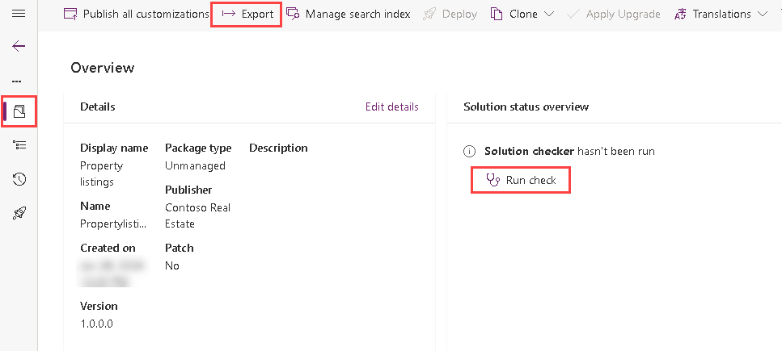
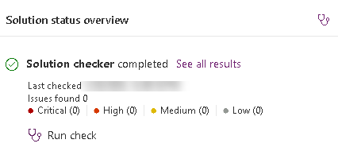
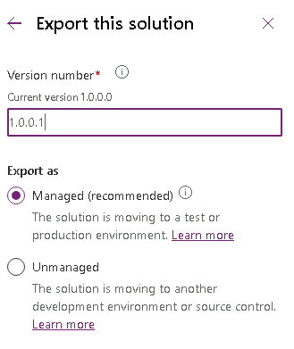

---
lab:
    title: 'Lab 6: Export solution'
    module: 'Module 4: Create tables in Dataverse'
---

# Practice Lab 6 - Export solution

## Scenario

In this lab, you will export the solution

## What you will learn

- How to a export a Microsoft Dataverse solution

## High-level lab steps

- Publish customizations
- Run Solution checker
- Export solution
  
## Prerequisites

- Must have completed **Lab 5: Configure model-driven app**

## Detailed steps

## Exercise 1 - Create publisher and solution

In this exercise, you will export the solution from the Development environment.

### Task 1.1 – Publish changes

1. Navigate to the Power Apps Maker portal <https://make.powerapps.com>.

1. Make sure you are in the **Dev One** environment.

1. Select **Solutions**.

1. Select the **Property listings** solution.

1. In the solution, select the **Overview** tab.

    

1. Select **Publish all customizations**.

### Task 1.2 – Solution checker

1. In the solution, select the **Overview** tab.

1. Select **Run check** under **Solution status overview**.

1. Wait a few minutes for the solution checker to complete.

    

1. You should see no warnings or errors.

### Task 1.3 – Export managed solution

1. Select **Export**.

1. Select **Next**.

1. The version number should have been incremented to **1.0.0.1**.

    

1. Select **Managed** for **Export as**.

1. Select **Export**.

1. The export will be prepared in the background. When the solution is ready, select the **Download** button.

### Task 1.4 – Export unmanaged solution

1. Select **Export**.

1. Select **Next**.

1. The version number should have been incremented to **1.0.0.2**.

1. Change the version number to `1.0.0.1`.

1. Select **Unmanaged** for **Export as**.

1. Select **Export**.

1. The export will be prepared in the background, when the solution is ready click the **Download** button.
